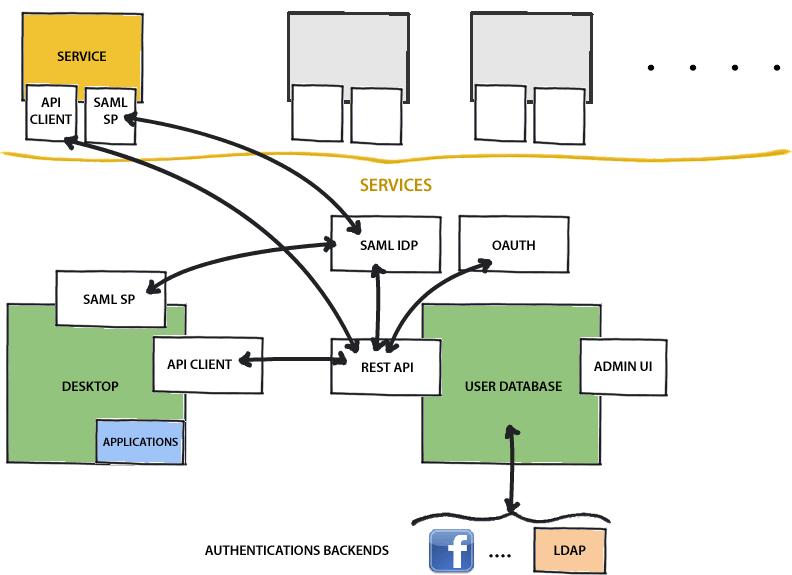

Dream platform
**************

Here you can find feature and API documentation how to use
the Dream platform when developing services that are
connected to the platform.

The platform is the basis which Dream services are
built on. From the platform these 3rd party services
have access to centrally managed features:

* User account database
* Single sign-on authentication
* Gadget desktop

Architecture
============

The Dream core platform has the following components:

.. toctree::
  :titlesonly:

  userdb/index
  desktop/index
  widget/index

As a whole the system looks like this:

User database
=============

User database is central place to handle everything
related to users, organisations, and permissions.

It provides SSO (single sign-on) and authentication.

Desktop
=======

Most of the visible UI of the platform comes from
:doc:`the gadget desktop </desktop/index>`.

Services can provide their own UIs in their own domains, but
they also can create :doc:`gadgets </desktop/gadget>` that
are shown in the desktop.

Dream Widget
============

All services should use :doc:`Dream Widget </widget/index>`
in their web pages. This way the user has direct access to the
Dream platform services from all pages.

